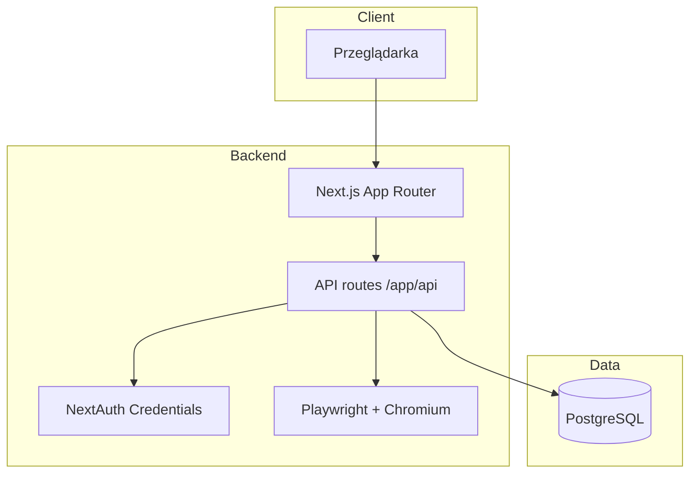
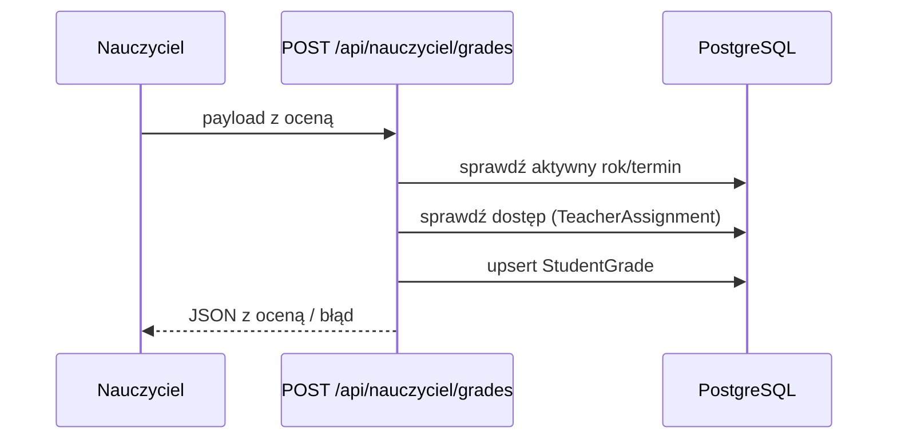
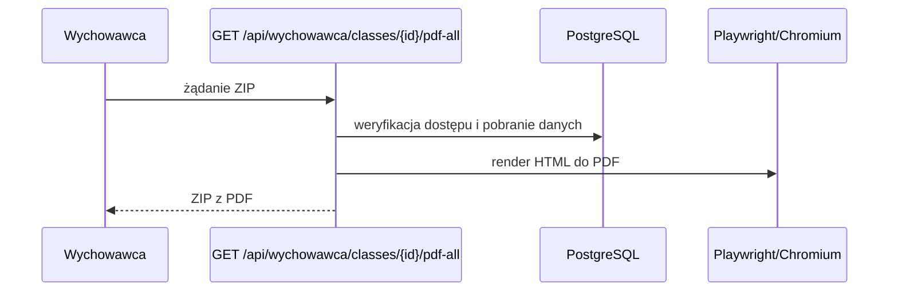

# Architektura

## Spis treści
- [Diagram high level](#diagram-high-level)
- [Granice modułów i kontrakty](#granice-modulow-i-kontrakty)
- [Model danych](#model-danych)
- [Sekwencje kluczowych flow](#sekwencje-kluczowych-flow)
- [Jak zweryfikować](#jak-zweryfikowac)

## Diagram high level

## Granice modułów i kontrakty
- `app/` — UI + API (App Router). API kontraktowane przez pliki `route.ts`.
- `lib/` — współdzielona logika (auth, permissions, prisma, pdf).
- `prisma/` — schemat danych, migracje i seed.
- `scripts/` — operacje utrzymaniowe (deploy, backup, reset DB).

Kontrakty:
- Autoryzacja po rolach (`requireRole`) oraz kontrola dostępu do klas/uczniów (`lib/permissions.ts`).
- API zwraca JSON (lub PDF/ZIP dla eksportów).

## Model danych
Źródło prawdy: `prisma/schema.prisma`. Kluczowe encje:
- `User` — użytkownicy i role (ADMIN/TEACHER/HOMEROOM/READONLY).
- `SchoolYear` — rok szkolny z flagami `isActive`, `gradingTerm`, `isGradingOpen`.
- `Class` — klasa w danym roku szkolnym (opcjonalny wychowawca).
- `Student` — uczniowie przypisani do klasy.
- `Subject` — słownik przedmiotów.
- `TeacherAssignment` — przypisanie nauczyciela do klasy i przedmiotu w danym roku.
- `MontessoriGradeScale` — słownik skali ocen.
- `StudentGrade` — oceny ucznia per przedmiot/rok/termin.

Relacje i ograniczenia:
- Unikalność ocen: `StudentGrade` ma klucz unikalny `studentId + subjectId + schoolYearId + term`.
- Unikalność przypisań: `TeacherAssignment` ma klucz `teacherId + subjectId + classId + schoolYearId`.

## Sekwencje kluczowych flow

### Zapis oceny przez nauczyciela

### Generowanie PDF dla klasy

## Jak zweryfikować
- Diagramy wynikają z `app/api/**/route.ts`, `lib/permissions.ts`, `lib/pdf/*`.
- Model danych potwierdź w `prisma/schema.prisma`.
